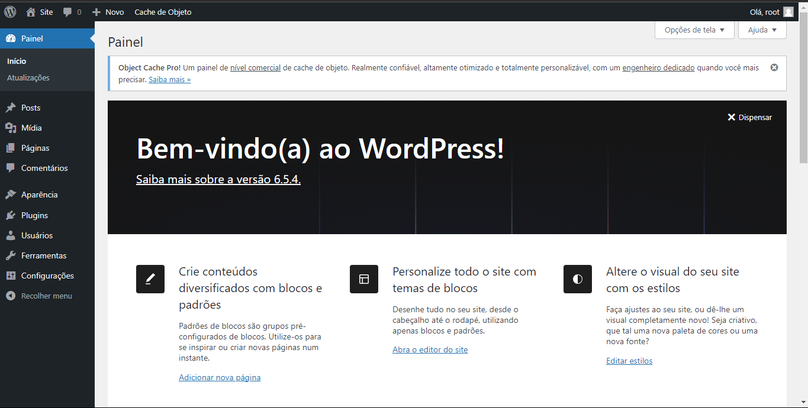
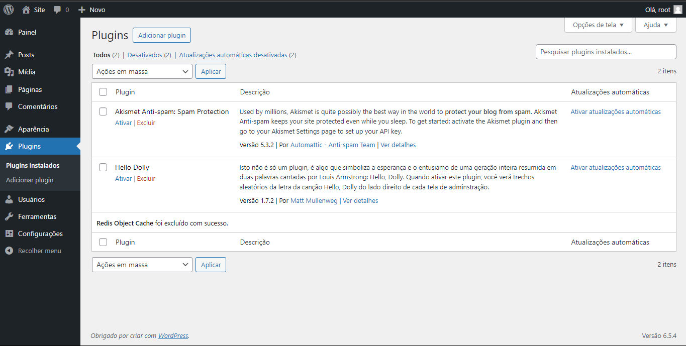
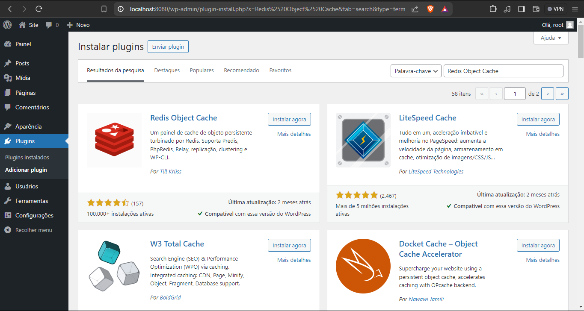
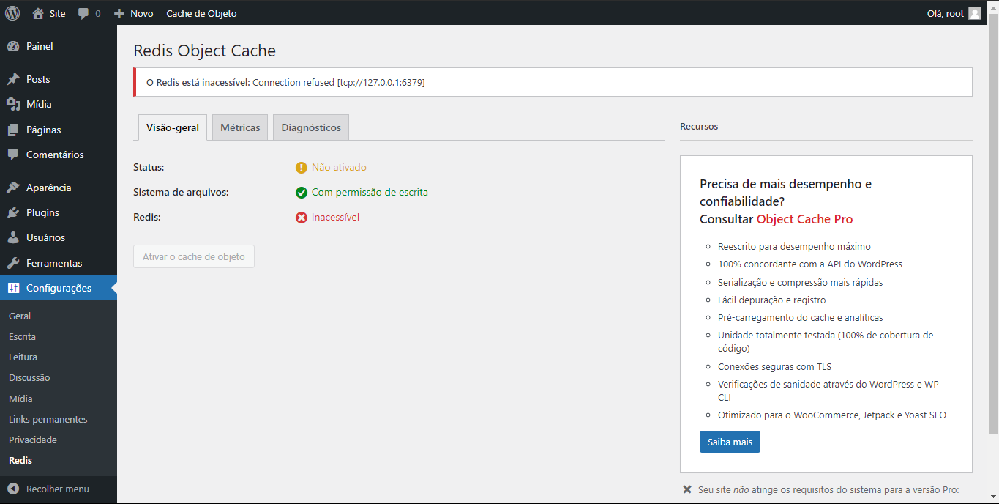
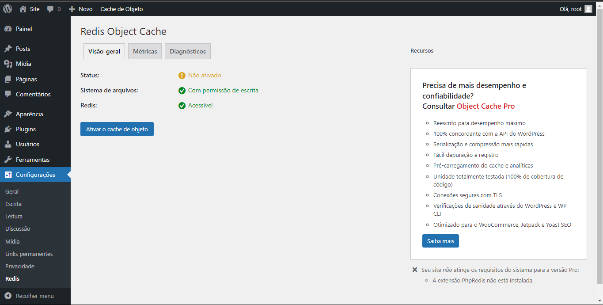
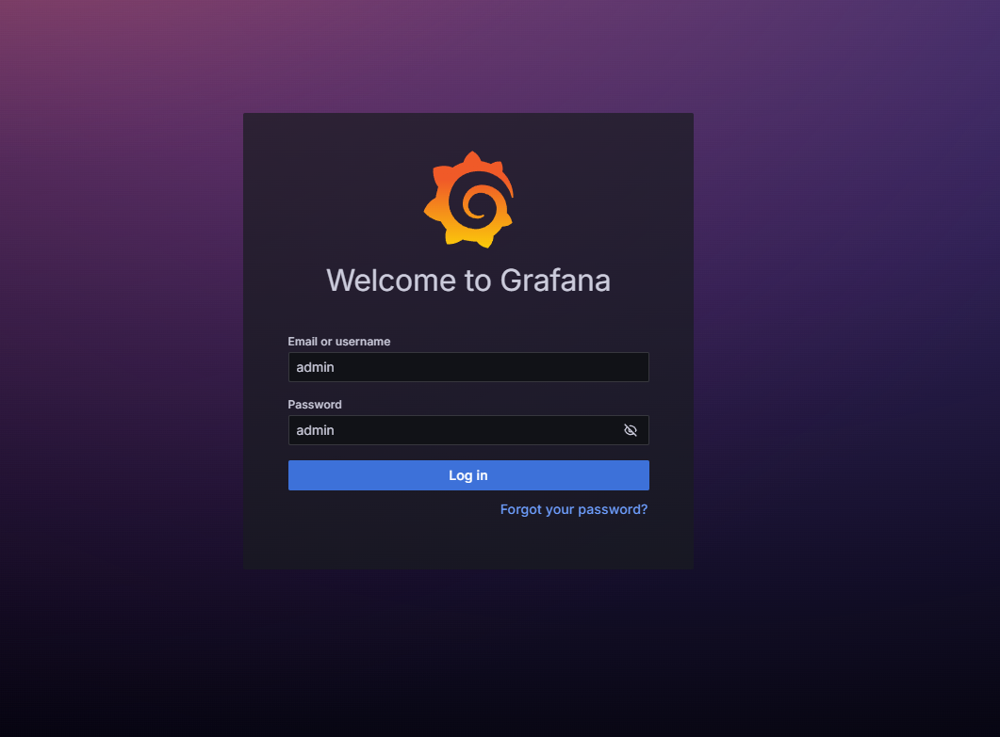

Claro, vou reformular o texto do read-me mantendo as descrições e o código inalterados.

---

<body style="text-align: justify">
    <h1>Passo-a-passo:</h1>
    

        <h2>Passo 1: Configure o ambiente</h2>
        <ol>
            <li>
Caso não tenha, instale o docker
</li>
            <li>
                

                    Deixe as portas que serão utilizadas no projeto disponiveis para uso.
                

                
As portas são:

                <ul>
                    <li>9104 : mysql-exporter</li>
                    <li>6379 : redis</li>
                    <li>8080 : wordpress</li>
                    <li>9090 : prometheus</li>
                    <li>3000 : grafana</li>
                    <li>8081 : cadvisor</li>
                </ul>
            </li>
        </ol>
    

    

    

        <h2>
            Passo 2: Clone e acesse o repositorio
        </h2>
        <ol>
            <li>
                

                    Em qualquer pasta de seu computador.
                

                
Em seguida, abra o Git Bash e digite o código a seguir:

                <pre><code>git clone https://github.com/JorgeLFGuedes/projetodocker-final.git</code></pre>
            </li>
            <li>
                Após clonar o repositorio, acesse ele:
                <pre><code>cd ProjetoDocker</code></pre>
            </li>
        </ol>
    

    

    

        <h2>Passo 3: Rodar o projeto</h2>
        <ol>
            <li>
                Agora vamos iniciar nosso Docker Swarm para podermos iniciar o projeto:
                <pre><code>docker swarm init</code></pre>
            </li>
            <li>
                Em seguida, rodar o comando:
                <pre><code>docker stack deploy -c docker-compose.yml "nome_stack"</code></pre>
                Após rodar este comando vamos iniciar nossos serviços que estão no arquivo .yml, sendo eles:
                <ul>
                    <li>mysql - database</li>
                    <li>mysql-exporter - exporta os dados do MySQL para serem acessados pelo Prometheus</li>
                    <li>redis - usado para armazenar em cache as queries feitas pelo WordPress</li>
                    <li>wordpress - nosso site</li>
                    <li>prometheus - ferramenta de monitoramento</li>
                    <li>grafana - transforma os dados do Prometheus em dashboards para melhor visualização</li>
                    <li>cadvisor - ferramenta para monitorar o Docker e seus containers</li>
                </ul>
            </li>
        </ol>
    

    

        <h2>Passo 4: Configurar o WordPress</h2>
        <ol>
            <li>Abra seu navegador e acesse o link: <code>http://localhost:8080</code></li>
            <li>
                Ao acessar o WordPress, configure-o seguindo suas instruções. Obs: não se preocupe com os dados informados, todos são apenas para teste.
            </li>
            <li>
                Finalizando o processo de configuração do WordPress, você será redirecionado à página de administrador:
                                  
            </li>
            <li>
                Nesta página, acesse a opção de plugins. Você será redirecionado para a página onde estão os plugins instalados:
                
            </li>
            <li>
                Ao lado da palavra Plugins, no topo da página, você terá a opção de Adicionar plugin. Clicando nesse botão, você será redirecionado para esta página:
                
            </li>
            <li>
                Pesquise na opção de busca o plugin: <code>Redis Object Cache</code>
                
                Clique na opção instalar, aguarde instalar e, após a instalação, volte para a página de <code>Plugins Instalados</code>.
            </li>
            <li>
                Abaixo dos plugins já instalados, irá aparecer o Redis Object Cache. Selecione a opção de Ativar (também pode aparecer como Configurações). Ao acessar essa página, podemos ver que não podemos nos conectar com o Redis:
                
            </li>
        </ol>
    

    

        <h2>Corrigir erro de conexão entre o Redis e o Docker</h2>
        <ol>
            <li>
                Para isso, vamos entrar no nosso terminal e digitar o comando <code>sudo su</code> para trocarmos para o usuário root do sistema. Faça login com sua senha de root, em seguida digite o comando <code>docker ps</code>:
                Listaremos todos os containers em execução. Nessa lista, vamos procurar o container que está instanciando o WordPress e copiar o CONTAINER ID dele.
            </li>
            <li>
                Vamos executar o comando <code>docker exec -it "ID DO SEU CONTAINER" bash</code>, assim vamos acessar a máquina que está executando o WordPress.
            </li>
            <li>
                Em seguida, vamos executar os comandos:
                <pre><code>apt update</code></pre>
                <pre><code>apt install nano</code></pre>
                Vamos atualizar o apt e em seguida baixar o aplicativo nano para que possamos editar o arquivo wp-config.php.
            </li>
            <li>
                Após a conclusão do passo anterior, digite o comando:
                <pre><code>nano wp-config.php</code></pre>
            </li>
            <li>
                Ao acessar a interface do nano, procure a linha que diz <code>/* That's all, stop editing! Happy publishing. */</code>
                E adicione as linhas:
                <pre><code>define('WP_CACHE', true); define('WP_REDIS_HOST', 'redis'); define('WP_REDIS_PORT', 6379);</code></pre>
            </li>
            <li>
                Salve o arquivo com o comando: "CTRL+O"; 
                Feche o arquivo com o comando: "CTRL+X";
            </li>
            <li>
                Volte para o painel de plugins do WordPress, atualize a página apertando "F5" e veja se o Redis aparece como Acessível:
                
                Estando assim, é só clicar no botão "Ativar o cache de objeto" e o Redis estará configurado.
            </li>
        </ol>
    

    

        <h2>Passo 5: Acessar o Prometheus</h2>
        <ol>
            <li>
                Acesse o link: <code>http://localhost:9090</code>. Você será redirecionado à tela inicial do Prometheus, também chamada de Graph. Nesta tela, podemos executar consultas de métricas.
            </li>
            <li>
                Podemos verificar métricas dos containers:
                <pre>container_cpu_system_seconds_total container_fs_reads_total container_fs_limit_bytes</pre>
                Também podemos visualizar as métricas do MySQL:
                <pre>mysql_exporter_collector_success mysql_global_status_connections mysql_global_status_max_used_connections</pre>
                Entre várias outras métricas.
            </li>
        </ol>
    

    

        <h2>Passo 6: Dashboard do Grafana</h2>
        <ol>
            <li>
                Acesse a página: <code>http://localhost:3000</code>. Você será redirecionado para a página do Grafana.
            </li>
            <li>
                Utilize o usuário admin e senha admin para entrar.
                
            </li>
            <li>
                Na dashboard, vamos em Connections e acessaremos a opção "Data sources".
                
            </li>
            <li>
                Nessa aba, vamos clicar no botão "Add data source" e buscar pelo Prometheus.
            </li>
            <li>
                Para configurar o data source do Prometheus, vamos selecioná-lo na lista, abrindo assim suas configurações.
                Em Connection, vamos adicionar a URL do servidor do Prometheus, sendo ela <code>http://prometheus:9090</code>.
                
            </li>
            <li>Após adicionar sua URL, vá até o final da página e clique no botão "Save & test". Assim podemos ir para as dashboards.</li>
            <li>Na dashboard do Grafana, clique em "Create Dashboard" e em seguida "Add visualization".</li>
            <li>No modal que aparecer, selecione o Prometheus.</li>
            <li>Na opção Query

, selecione a métrica do Prometheus e clique em run query.</li>
            <li>
                Assim será gerado um gráfico. Clique na opção "Apply" no canto superior direito.
                
            </li>
    

</body>

---